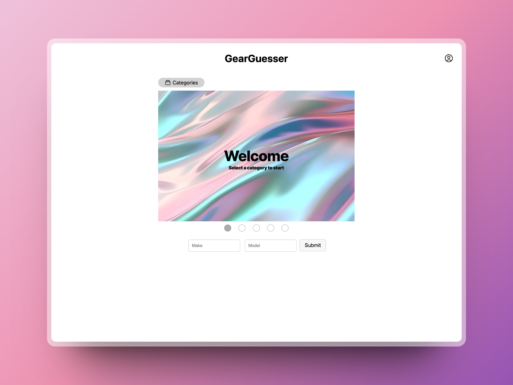

# GearGuesser

GearGuesser is a Wordle-inspired game where you guess the make and model of a car based on a cropped image of the exterior. The game is built for CS 4640 - Programming Languages for Web Applications at the University of Virginia. You can play the game [here](https://cs4640.cs.virginia.edu/azk7ad/gearguesser/).

  

## Technologies Used

- PHP
- HTML/CSS
- JavaScript
- jQuery
- Docker

## How to Play

1. Select a category of cars and click 'Start Game'. When the game starts, you will see a cropped image of a car. Your task is to guess the make and model of the car.
2. Enter your guesses in the "Make" and "Model" input fields and click the "Submit" button.
3. If your guess is correct, you will see a "Congratulations!" message and the game will end. If your guess is incorrect, you will see a message indicating that your guess was wrong and you can try again.
4. You can click the "Play Again" button to start a new game.
5. Your game statistics, such as total games played, correct guesses, fastest guess, and average attempts per game, are displayed on the page.
